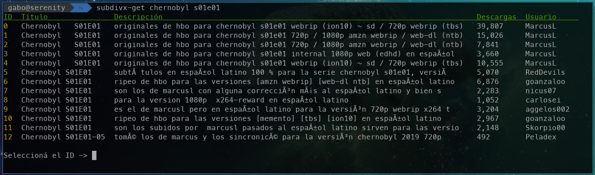
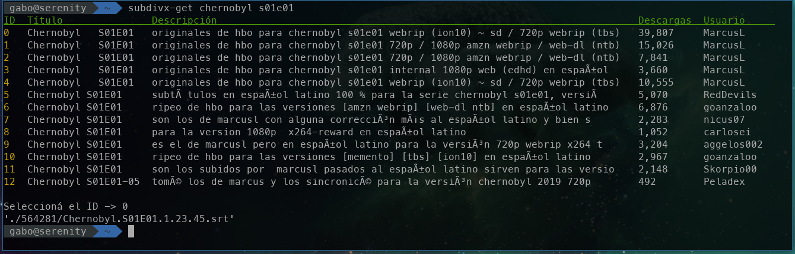
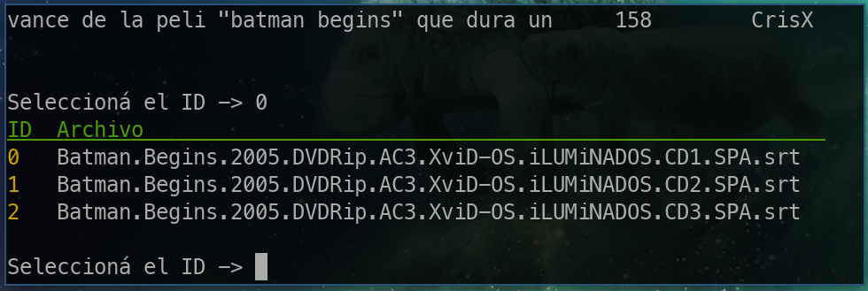

# Subdivx-get
## Introducción
`subdivx-get` es una aplicación de terminal para obtener subtítulos en Español del sitio [subdivx.com](https://subdivx.com).

El único parámetro requerido es el nombre de la película o serie que se quiere obtener. El script despliega una lista con los resultados encontrados, se elige el resultado deseado, luego el programa descarga y descomprime los archivos correspondientes y devuelve la ruta del archivo de subtítulos.

## Instalación
Para poder hacer la instalación es necesario bajar el compilador de Go, instrucciones de como instalar Go se pueden encontrar [aquí](https://golang.org/doc/install). 

Luego obtenemos el proyecto, puede ser mediante ssh o https:
```
git clone git@github.com:gnuy/subdivx-get.git
```

```
git clone https://github.com/gnuy/subdivx-get.git
```
Ingresamos al directorio e instalamos:
```
cd subdivx-get
go install
```

## Uso
Una vez instalado, desde la terminal ingresamos `subdivx-get <nombre de película o serie>`. Esto nos va a devolver la lista de subtítulos que se corresponden a la búsqueda:


Elegimos cual nos interesa ingresando el ID. La aplicación descarga, descomprime el elemento y nos devuelve la ruta del archivo. Por defecto va a crear un directorio con el id que nos devuelve subdivx que es único en el directorio actual.



En caso que el archivo descomprimido tenga más de un archivo adentro, se van a descomprimir todos pero se nos va a devolver un menú para elegir uno de ellos (de los que tienen extensión `.srt`) para que nos devuelva la ruta. 




## Parámetros
```bash
$ subdivx-get --help
Usage of subdivx-get:
  -7	modo suerte 🍀
  -l string
    	ubicación de los subs en el filesystem (default ".")
  -n int
    	número de sub en la lista (default -1)
  -v	modo verboso
```

`-7` modo "feeling lucky", elige el primer elemento que encuentra, no despliega ningún menú, solo imprime la ruta del `.srt`  

`-l <ruta>` sirve para especificar sobre que directorio se van a descargar los archivos, por defecto se usa el directorio donde estamos parados.

`-n <número>` deja pasarle el índice del elemento a descomprimir sin tener que imprimir la lista.  

`-v` imprime banda de logs.